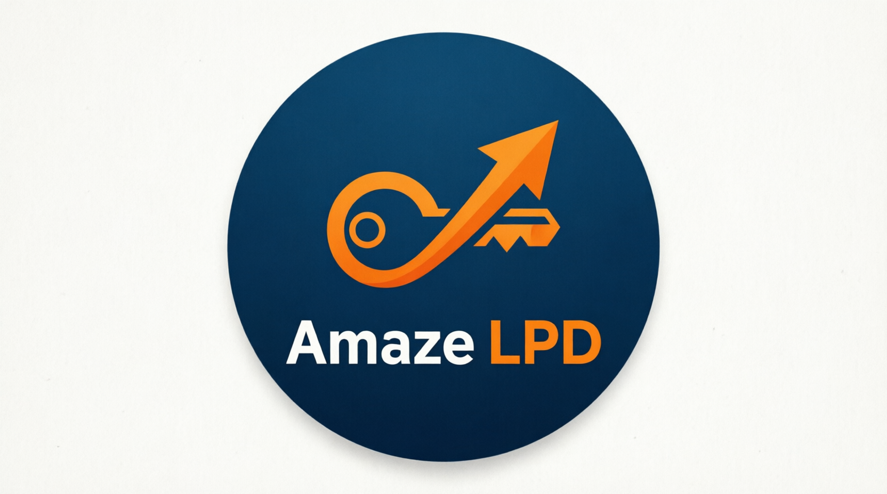
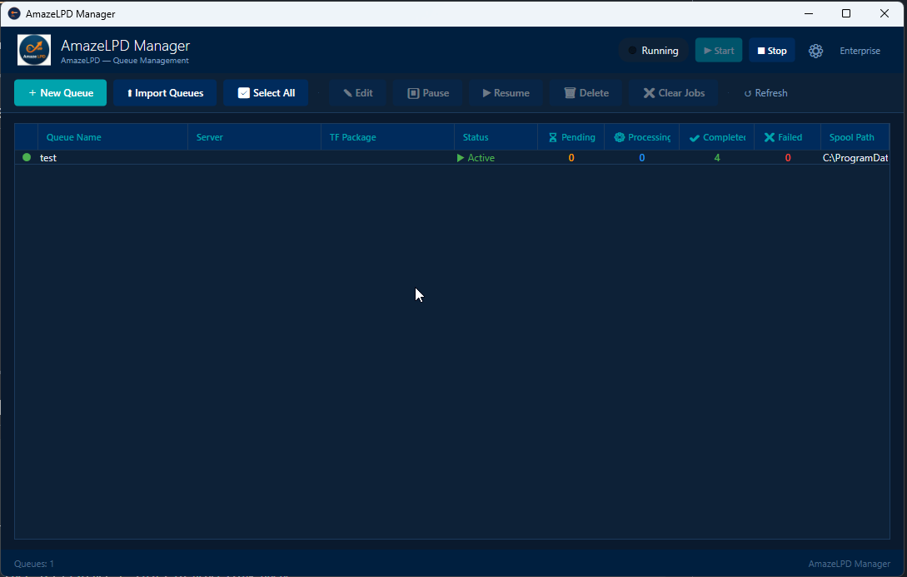
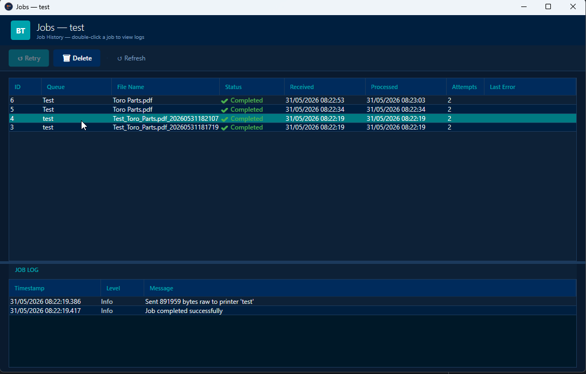
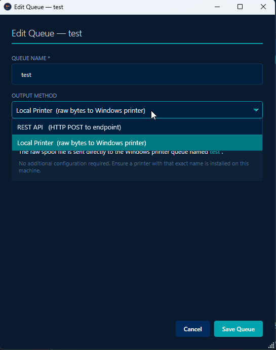

<div align="center">



# AmazeLPD

### LPD/LPR Print Gateway for Windows

**Receive print jobs from AS400, Linux, Unix, SAP, and mainframe — and forward them to any Windows document processing platform.**

[](LICENSE)
[](https://github.com/traviscitrine/AmazeLPD/releases)
[](https://github.com/traviscitrine/AmazeLPD/releases)
[](mobitech7.gumroad.com/l/awtuic)

[**Download Trial**](#download) · [**Documentation**](docs/README.md) · [**Buy a Licence**](#pricing) · [**Getting Started**](#quick-start)

---

</div>

## The Problem

Microsoft has deprecated the Windows LPD service and removal is imminent.

Thousands of enterprises rely on LPD/LPR to route print jobs from **AS400 Output Queues, Linux, Unix, SAP, and mainframe systems** to Windows servers. When Microsoft removes LPD from Windows Server, those print pipelines break.

**AmazeLPD is the replacement.**

It runs as a Windows service on port 515, receives any LPR print job, and forwards it to your document processing platform — keeping your existing infrastructure working without changes to the sending side.

---

## Who is this for?

| You have... | AmazeLPD does... |
|---|---|
| IBM i / AS400 Output Queues printing via LPR | Receives the job, forwards to your document platform |
| Linux / Unix systems printing to Windows | Drops in as a replacement LPD endpoint |
| SAP or Oracle EBS legacy spool output | Accepts the print stream, routes it onward |
| Mainframe LPD output | Receives and forwards without changes to the mainframe |
| Microsoft LPD being removed from your Windows Server | Replaces it transparently — no changes to print clients |

---

## Key Features

- **Windows Service** — installs and runs as a standard Windows service, starts automatically
- **RFC 1179 compliant** — works with any LPR client including AS400, Linux, CUPS, and Windows lpr.exe
- **Concurrent queue processing** — one worker thread per queue, all queues process simultaneously
- **Per-queue configuration** — each queue has its own destination server, branch, and parameters
- **Job history and logging** — full audit trail of every job received, processed, and delivered
- **Pause and resume** — pause individual queues without losing jobs; they queue up and process on resume
- **CSV bulk import** — import hundreds of queues at once from a spreadsheet
- **7-day trial** — full functionality, no credit card required
- **No dependencies** — no SQL Server, no additional runtime, no configuration required beyond installation

---

## Quick Start

**1. Download and install**
```
Download the latest release → Run the installer → Service starts automatically
```

**2. Create a queue**

Open **AmazeLPD Manager** and click **New Queue**:
- Queue Name: `MYQUEUE` (must match the `-P` parameter in your lpr command)
- Destination Server: your document processing server address
- Package/Branch: your processing package name

**3. Send a test job**
```cmd
lpr -S <your-server-ip> -P MYQUEUE "C:\test.pdf"
```

**4. Done.** The job appears in the manager with status Completed.

---

## Screenshots

<div align="center">

### Queue Manager


### Job History


### Queue Configuration


</div>

---

## Architecture

```
LPR Client (AS400 / Linux / Unix / SAP / Mainframe)
         │
         │  TCP port 515  (RFC 1179)
         ▼
┌─────────────────────┐
│   AmazeLPD Service  │  Windows Service
│                     │  Receives job → writes to disk
│   Port 515 Listener │  Posts to processing queue
└──────────┬──────────┘
           │
           ▼
┌─────────────────────┐
│   Queue Processor   │  One thread per active queue
│                     │  Builds XML envelope
│   (per queue)       │  Forwards to destination
└──────────┬──────────┘
           │
           ▼
┌─────────────────────┐
│  Document Platform  │  Your Windows-based
│  (any XML-capable   │  document processing
│   system)           │  software
└─────────────────────┘
```

**Design highlights:**
- Hot path has **zero database contact** — jobs hit disk in milliseconds
- **Concurrent processing** — 100 queues process simultaneously, no queue blocks another
- **SQLite embedded database** — no SQL Server required, no external dependencies
- Survives service restarts — pending jobs resume automatically

---

## Compatibility

### Sending platforms (anything that speaks LPR)
| Platform | Method | Notes |
|---|---|---|
| IBM i / AS400 | OS/400 Output Queue (OUTQ) | Configure remote system + remote printer queue |
| Linux / Unix | lpr command / CUPS | Standard LPR output |
| AIX | lpr / lpd | Native support |
| SAP | Spool output via LPR | Configure SAP output device |
| Oracle EBS | Concurrent Manager print | LPR output method |
| Mainframe z/OS | JES spool LPR output | Standard configuration |
| Windows | lpr.exe or print queue with LPR port | Built-in Windows lpr.exe |
| HP-UX / Solaris | lpr | Native support |

### Receiving platforms (what AmazeLPD forwards to)
Any platform that accepts XML document input on a TCP connection. AmazeLPD wraps the job in a standard XML envelope with configurable parameters.

---

## Pricing

| Licence | Price | Servers | Updates |
|---|---|---|---|
| 7-Day Trial | Free | 1 | Full functionality |
| Single Server — Perpetual | Contact for pricing | 1 | Not included |
| 5-Server Pack — Perpetual | Contact for pricing | 5 | 2 years included |
| Subscription | Contact for pricing | As specified | Included |

[**Get your licence on Gumroad →**](https://gumroad.com)

---

## Download

Download the latest release from the [**Releases**](https://github.com/traviscitrine/AmazeLPD/releases) page.

| File | Description |
|---|---|
| `AmazeLPD_Setup_x64.msi` | Windows installer (recommended) |
| `AmazeLPD_Manual_x64.zip` | Manual installation (no installer) |

**System Requirements:**
- Windows Server 2016 / 2019 / 2022 or Windows 10 / 11
- .NET Framework 4.8 (included in Windows Update)
- 50MB disk space
- Port 515 available

---

## Installation

### Installer (recommended)
1. Run `AmazeLPD_Setup_x64.msi`
2. Follow the installation wizard
3. The service installs and starts automatically
4. Open **AmazeLPD Manager** from the Start menu

### Manual installation
```cmd
cd "C:\Program Files\AmazeLPD\bin"
C:\Windows\Microsoft.NET\Framework64\v4.0.30319\InstallUtil.exe AmazeLPD_Service.exe
sc start AmazeLPD_Service
```

---

## Why not just use PaperCut or IBM's LPD?

| | AmazeLPD | PaperCut | IBM LPD |
|---|---|---|---|
| Lightweight Windows service | ✅ | ❌ Heavy print management suite | ✅ |
| Per-queue destination routing | ✅ | ❌ | ❌ |
| XML envelope with custom parameters | ✅ | ❌ | ❌ |
| Job history and audit log | ✅ | ✅ | ❌ |
| No SQL Server required | ✅ | ❌ | ✅ |
| Priced for enterprise | ✅ | ❌ Very expensive | N/A |
| Actively maintained | ✅ | ✅ | ❌ |

---

## FAQ

**Q: Will this work after Microsoft removes LPD from Windows Server?**
Yes — AmazeLPD is a standalone Windows service that does not depend on the Microsoft LPD service at all. It implements RFC 1179 independently.

**Q: Do I need to change anything on the AS400 / sending side?**
No. AmazeLPD receives standard LPR jobs. Your AS400 Output Queue, Linux lpr command, or any other LPR client continues working exactly as before — just point it at the AmazeLPD server IP.

**Q: What happens to jobs if the destination server is unavailable?**
Jobs are spooled to disk and held as Pending. When the destination becomes available, they are processed automatically. You can also pause and resume individual queues from the manager UI.

**Q: Can I run multiple queues pointing to different destinations?**
Yes — each queue has its own server address, package/branch, and parameters. You can have 100 queues all routing to different destinations simultaneously.

**Q: Is the trial fully functional?**
Yes. The 7-day trial is the full product with no feature restrictions.

**Q: What format does AmazeLPD use to forward jobs?**
XML envelope with the job file base64-encoded inside. A legacy format is also supported for older systems.

---

## Support

AmazeLPD is provided as-is under the terms of the [licence agreement](LICENSE). No formal support obligations are included.

For pre-sales questions or licensing enquiries, open a [GitHub Issue](https://github.com/traviscitrine/AmazeLPD/issues) or contact via Gumroad.

---

## Licence

AmazeLPD is proprietary software. See [LICENSE](LICENSE) for full terms.

© 2026 Travis Citrine. All rights reserved.

---

<div align="center">

**[Download Trial](https://github.com/traviscitrine/AmazeLPD/releases) · [Buy a Licence](https://gumroad.com) · [Documentation](docs/README.md)**

*Solving the Microsoft LPD deprecation problem — one print queue at a time.*

</div>
